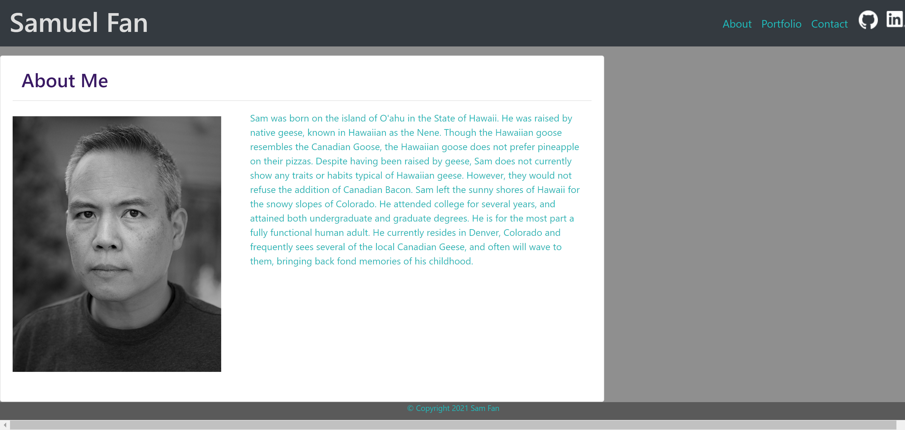
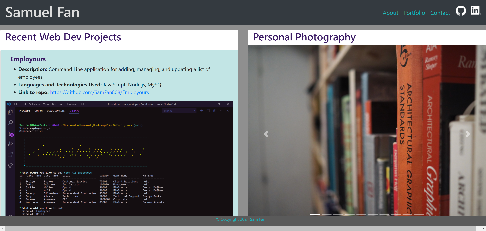
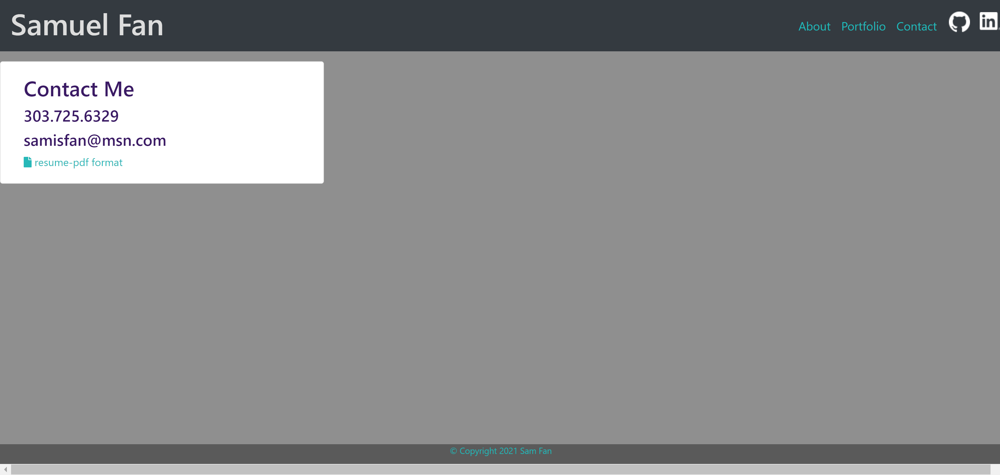

# Portfolio-React

# Project Name: Portfolio-React

## Description

Revised portfolio using React

## Table of Contents

1. [Installation](#installation)

2. [Languages](#languages)

3. [License](#license)

4. [Screenshots](#screenshots)

5. [Questions](#questions)

## Installation

Link to deployed site: https://portfolio-samfan.netlify.app/

## Languages

`Javascript, React, CSS`

## License

Licensed under: MIT license

## Screenshots

## Questions

GitHub Repository:

https://github.com/SamFan808/portfolio-react
